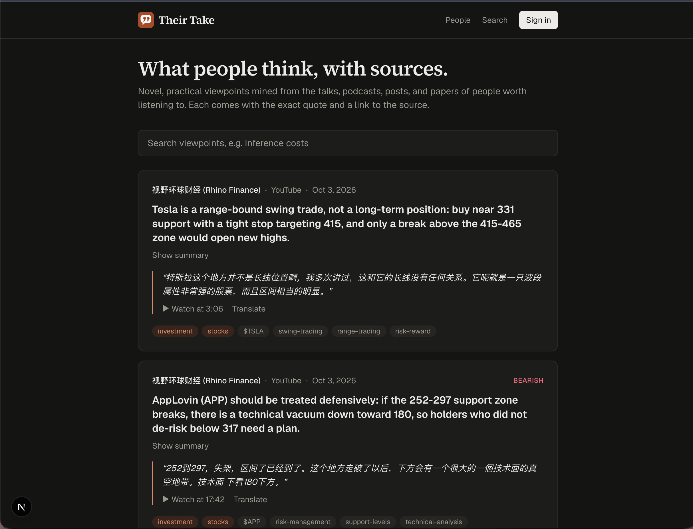

# Their Take

*What people think, with sources.*

Their Take watches people worth listening to across YouTube, podcasts, blogs, Substack, and
arXiv. It mines their media for novel, useful, practical viewpoints (at most three per item),
credits each to whoever actually said it, and publishes them with the exact quote and a link to
the source.



## Quick start

```bash
cd backend
cp .env.example .env            # add ANTHROPIC_API_KEY (and GEMINI_API_KEY, VOYAGE_API_KEY)
uv sync && uv run alembic upgrade head && uv run python -m scripts.seed

uv run huey_consumer app.workers.tasks.huey -w 2 -k thread   # worker
uv run uvicorn app.main:app --port 8000                      # API (another terminal)
cd ../web && npm install && npm run dev                      # website on :3000 (another terminal)
```

## Documentation

- [Idea](docs/01-idea.md)
- [Requirements](docs/02-requirements.md)
- [Design](docs/03-design.md)
- [Implementation](docs/04-implementation.md)
- [User manual](docs/05-user-manual.md)

## Tests

```bash
cd backend && uv run pytest && uv run ruff check app tests scripts
cd web && npx tsc --noEmit && npm run lint
```

## Privacy

Their Take collects as little as it needs.

- **Browsing needs no account.** Reading the feed, people pages, and search stores nothing
  about you. Like most web servers, the API's request log records IP addresses and the pages
  requested.
- **Signing in stores** your email address (email sign-in), or your Discord user ID and
  verified email (Discord sign-in). They are used only to sign you in and, once subscriptions
  launch, to deliver the viewpoints you subscribe to.
- **Cookies:** one signed session cookie that keeps you signed in for 30 days, and a
  short-lived cookie used only during Discord sign-in. There are no analytics, advertising, or
  tracking cookies.
- **Third parties:** sign-in emails are sent through Resend. (Without an email service
  configured, as in local development, sign-in links and the address they're for are written to
  the server log instead.) The content of public media
  (transcripts, posts, papers) is processed by Anthropic (Claude), Google (Gemini), and Voyage AI
  to extract and index viewpoints. No account information is sent to these AI providers.
- **Your data stays with the operator** of the deployment, in its own database, and is never
  sold or shared. To have your account deleted, contact the operator.

## Copyright

© 2026 David Xu. All rights reserved.

Viewpoints are summaries of publicly available media, each credited to its speaker and linked
to its source. Quoted excerpts are kept short and remain the property of their speakers and
publishers. To have content corrected or removed, contact the repository owner.
