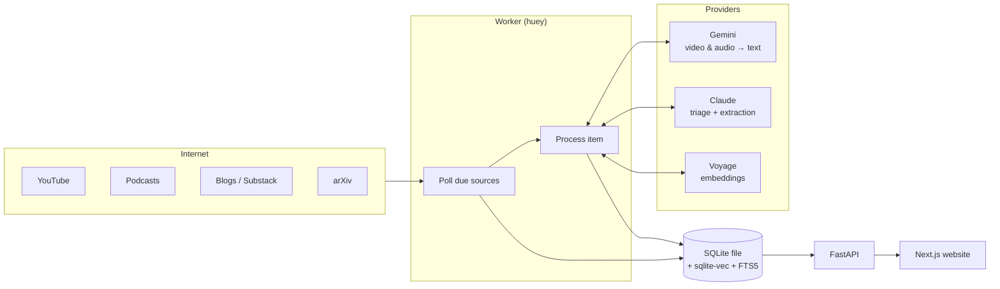
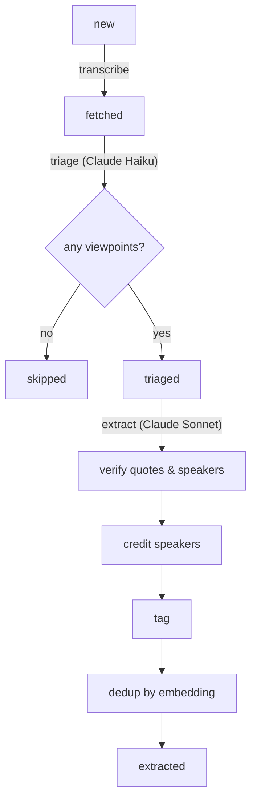
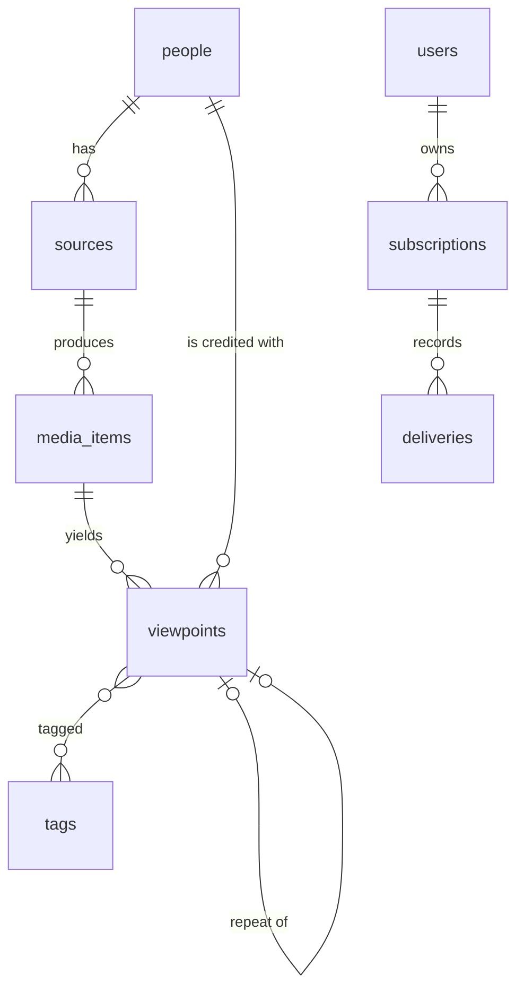

# Design

## Architecture

Four processes share one SQLite database file:

| Process | Role |
|---|---|
| **Worker** | Polls sources on a schedule and runs each new media item through the pipeline. |
| **API** (FastAPI) | Serves viewpoints, people, search, sign-in, and admin endpoints under `/api`. |
| **Web** (Next.js) | Renders the website. Forwards `/api/*` to the API, so the browser sees one site. |
| **Discord bot** | Posts viewpoints and handles subscriptions (planned, phase 5). |

## The pipeline

Each new media item moves through these steps. Its `status` records progress, so a restarted
worker resumes where it stopped.

1. **Poll.** A per-platform adapter reads the source's feed. New items are inserted, keyed on
   (platform, external id), so re-polling never duplicates. ETags avoid refetching unchanged
   feeds.
2. **Transcribe.** Text sources use the feed body. YouTube tries free captions first and falls
   back to Gemini, which accepts a YouTube URL directly; Claude can't take video or audio
   input. Podcasts send the episode audio to Gemini. Transcripts keep `[mm:ss]` markers.
3. **Triage.** Claude Haiku reads the opening of the item and decides whether anyone in it
   states a real viewpoint. Most announcements and short posts stop here, cheaply.
4. **Extract.** Claude Sonnet reads the whole item and returns up to 3 viewpoints as structured
   output: speaker, claim, summary, verbatim quote, timestamp, stance, confidence, and tags. The
   prompt defines "novel, useful, practical" and requires crediting guests rather than the host.
5. **Verify.** Each quote must fuzzily match the source text (to tolerate transcript noise).
   Each speaker other than the tracked person must be named in the content. Anything that
   fails is dropped, then the list is cut to 3.
6. **Credit speakers.** A speaker is matched to the tracked person, then to an existing person
   by name, and otherwise created as a new auto-added person with a bio taken from the content.
7. **Tag.** Domains come from a fixed list of 17 (ai, semiconductors, stocks, …); topics,
   entities, and tickers are open-ended and normalized to slugs. Each ticker comes with its
   company name, and a company that has a ticker is tagged only by the ticker.
8. **Dedup.** The claim is embedded and compared with the speaker's viewpoints from the last 90
   days. At cosine similarity 0.90 or above, it is stored as a repeat of the earlier viewpoint
   and hidden from the feed.

## Data model

| Table | Key fields |
|---|---|
| `people` | name, slug, bio, domains, `auto_added` (true for discovered guests) |
| `sources` | person, platform, handle (feed URL, `@handle`, or query), poll interval, last polled, ETag |
| `media_items` | source, platform + external id (unique), url, title, published date, transcript, status, error, LLM token usage |
| `viewpoints` | media item, **person (the speaker)**, claim, summary, quote (original language), quote translation (English, for non-English quotes), timestamp, stance, confidence, novelty, repeat of |
| `tags` | kind (domain / topic / entity / ticker), slug, name |
| `viewpoint_vec` | sqlite-vec table: one 1024-dim embedding per viewpoint, partitioned by person so dedup only scans the speaker's own rows |
| `viewpoint_fts` | FTS5 index over claim, summary, quote; kept in sync by triggers |
| `users`, `subscriptions`, `discord_channel_feeds`, `deliveries` | Accounts and phase 5 delivery state; `deliveries` is unique per (target, viewpoint, channel) |

A viewpoint's **speaker** (`viewpoints.person`) can differ from the **source owner**
(`media_items → sources → people`). That difference is what the site shows as "via".

## Key decisions

| Decision | Why |
|---|---|
| **SQLite, not Postgres** | One file, no server. sqlite-vec covers vector search and FTS5 covers keyword search. Fine for one host and tens of thousands of viewpoints a month. Everything goes through SQLAlchemy, so moving to Postgres is a configuration change plus a migration. |
| **huey on SQLite, not Redis** | Same reason: no extra server. A single worker avoids SQLite write contention. |
| **Gemini for video and audio only** | Claude can't take a YouTube URL or audio. Gemini produces timestamped text; Claude then does all extraction, so the extraction logic lives in one place. |
| **Two Claude models** | Haiku screens cheaply; Sonnet does the careful extraction. Sonnet has a server-side refusal fallback enabled, so a rare safety decline is retried on another model. |
| **Whole transcripts, no chunking** | A three-hour podcast fits in context. The model sees the whole conversation, which matters for picking the best 3 and for knowing who said what. |
| **Structured output, not tool calls** | Guarantees schema-valid JSON on the current Sonnet model, which doesn't allow forcing a tool call. |
| **Verify, don't trust** | Quotes and speaker names are checked against the source, which guards against invented quotes and people. |
| **English claims, original-language quotes** | One language across the site, so takes from Chinese and English sources can be compared; the untranslated quote keeps every viewpoint verifiable against its source. |
| **Claim first, details on demand** | Cards show the claim and quote; the summary and translation sit behind buttons so the feed stays scannable. |
| **Cap at 3 per item** | Keeps quality high and the feed readable. Enforced both in the prompt and in code. |
| **Signed-cookie sessions in FastAPI** | One auth system for email and Discord; no session table. The web server forwards `/api`, so cookies are first-party. |
| **First poll limited to 14 days** | Adding a person with years of back catalog shouldn't trigger hundreds of paid extractions. |

## Security and privacy

- Sessions are signed with `SECRET_KEY` and last 30 days; cookies are HTTP-only and SameSite=Lax.
- Admin rights come from the `ADMIN_EMAILS` setting, not from the database.
- The Discord sign-in flow checks a state value to prevent forged callbacks.
- Pages publish short quotes and links, not full transcripts.
- Known gap: a sign-in link can be reused within its 15 minutes.
